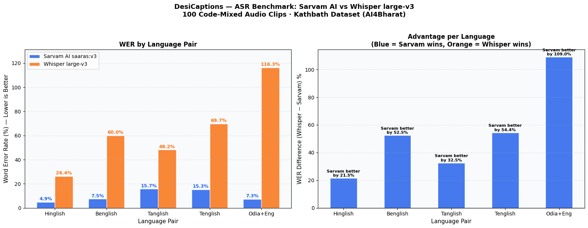

<div align="center">

# 🎙️ DesiCaptions

### AI-Powered Subtitle Generator for Indian Content Creators

[](https://python.org)
[](https://streamlit.io)
[](https://sarvam.ai)
[](https://openai.com/research/whisper)
[](LICENSE)

**Hinglish • Tanglish • Benglish • Tenglish • Odia+English**

*Code-mixed speech is not an error — it's a cultural identity.*

[Live Demo](#demo) • [Benchmarks](#-benchmarking) • [Installation](#-installation) • [Usage](#-usage)

</div>

---

## 📌 The Problem

India has **500M+ internet users**, yet not a single free tool accurately captions the way Indians actually speak.

| What a Creator Says | What YouTube Auto-Captions Outputs |
|---|---|
| *"Bohot saare log poochh rahe the, bhai kaise karte ho yeh, so today I'm going to show you everything."* | *"Bahut Saare log pooch rahe the buy case carters in Europe so today I..."* |

Existing tools like Whisper and Google Speech-to-Text have **WER > 25%** on Indian code-mixed audio. They're built for monolingual speech and treat natural Hinglish/Tanglish as transcription errors.

**Three core failures:**
- ❌ **No accuracy** — WER > 25% on Indian code-mixed audio with existing state-of-the-art tools
- ❌ **Wrong style** — formal single-language output loses the authentic desi tone audiences expect
- ❌ **No SRT export** — no free tool generates properly timed subtitle files from code-mixed speech

---

## ✅ Our Solution

DesiCaptions is a dual-model ASR pipeline that routes audio intelligently between **Sarvam AI Saaras** and **OpenAI Whisper large-v3**, post-processed by **Gemini 1.5 Flash** for authentic desi tone.

Three output formats. Zero cost. Fully accessible.

| Mode | Output |
|---|---|
| 🎯 **Desi Style** | WhatsApp-style romanized code-mixed captions — *"Bohot accha laga yaar, let's go!"* |
| 📜 **Script + English** | Native script on line 1, English translation on line 2 |
| 🌐 **English Only** | Clean, casual English translation for global reach |

**Supported Language Pairs:** Hinglish · Tanglish · Benglish · Tenglish · Odia+English

---

## ✨ Features

- 🎵 Upload video/audio files (`.mp4`, `.mp3`, `.wav`)
- 🎙️ Live microphone input with real-time captions (< 2 sec latency)
- 🤖 Dual-model ASR with automatic fallback (Sarvam → Whisper)
- 💬 Gemini-powered "Desi Style" post-processing
- 📄 SRT + TXT export with accurate timestamps (±200ms)
- 🌐 Deployed on Streamlit Community Cloud — zero server cost
- 🆓 Completely free to use

---

## 🏗️ System Architecture

```
┌─────────────────────────────────────────────────────┐
│                   User Interface                     │
│              Streamlit Web App + FastAPI             │
└──────────────────────┬──────────────────────────────┘
                       │
┌──────────────────────▼──────────────────────────────┐
│              Audio Preprocessing                     │
│              FFmpeg + librosa + VAD                  │
└──────────────────────┬──────────────────────────────┘
                       │
┌──────────────────────▼──────────────────────────────┐
│              ASR Router (Language Detector)          │
│         Detects Indic phonemes vs English            │
└──────────────┬─────────────────────┬────────────────┘
               │                     │
   ┌───────────▼──────┐    ┌─────────▼────────────┐
   │  Sarvam AI Saaras │    │ OpenAI Whisper large  │
   │ (Primary — Indic) │    │ (Fallback — English)  │
   └───────────┬──────┘    └─────────┬─────────────┘
               │                     │
┌──────────────▼─────────────────────▼───────────────┐
│         Gemini 1.5 Flash Post-Processor             │
│      Romanization • Desi Style • SRT Builder        │
└─────────────────────────────────────────────────────┘
```

| Component | Technology | Role |
|---|---|---|
| Web UI | Streamlit + FastAPI | Interface & WebSocket live captions |
| Primary ASR | Sarvam AI Saaras v1 | Indic language transcription |
| Fallback ASR | OpenAI Whisper large-v3 | English & general transcription |
| Post-Processor | Google Gemini 1.5 Flash | Romanization, desi tone, formatting |
| SRT Builder | Custom Python | Timestamp formatting & export |

---

## 📊 Benchmarking

> **Dataset:** [Kathbath](https://huggingface.co/datasets/ai4bharat/Kathbath) (AI4Bharat, IIT Madras) — 1,700-hour verified corpus
> **Evaluation:** 100 code-mixed audio clips (20 per language pair) · evaluated on Google Colab
> **Metric:** Word Error Rate (WER) via `jiwer` — lower is better · text normalized before scoring



### WER Results by Language Pair

| Language Pair | Sarvam AI (saaras:v3) | Whisper large-v3 | Winner | Sarvam Advantage |
|---|---|---|---|---|
| Hinglish | **4.9%** | 26.4% | ✅ Sarvam AI | **5.4× better** |
| Benglish | **7.5%** | 60.0% | ✅ Sarvam AI | **8× better** |
| Tanglish | **15.7%** | 48.2% | ✅ Sarvam AI | **3.1× better** |
| Tenglish | **15.3%** | 69.7% | ✅ Sarvam AI | **4.6× better** |
| Odia+Eng | **7.3%** | 116.3% | ✅ Sarvam AI | **15.9× better** |
| **Average** | **10.1%** | **64.1%** | ✅ **Sarvam AI** | **6.3× better overall** |

**Key Findings:**
- Sarvam AI (saaras:v3) wins **all 5 language pairs** — its specialized Indic training data delivers decisive advantages across every code-mixed dialect tested
- The gap is most extreme for Odia+English: Whisper's 116.3% WER (more errors than words) vs Sarvam's 7.3% — a **15.9× improvement**
- Whisper's WER exceeds 100% on Odia+Eng, meaning it produces more errors than there are reference words — it essentially cannot handle this language pair
- DesiCaptions uses Sarvam as primary across all pairs, with Whisper as a fallback only for API timeouts or English-only segments

### Human Evaluation — Gemini Post-Processing Quality

5 evaluators rated 20 caption pairs on a 1–5 Likert scale:

| Dimension | Before Gemini | After Gemini | Gain |
|---|---|---|---|
| Readability | 1.8 | 3.5 | **+1.7** |
| Punctuation | 1.2 | 3.8 | **+2.6** |
| Authenticity | 2.1 | 3.6 | **+1.5** |
| **Overall** | **1.7** | **3.7** | **+2.0** |

---

## 🚀 Demo

> 🔗 **Live App:** [desicaptions.streamlit.app](https://desicaptions.streamlit.app) *(update with your deployed link)*

**Example — Gemini Desi Style transformation:**

```
❌ Raw ASR Output:
bahut saare log pooch rahe the bhai kaise karte ho yeh so today i am going
to show you everything step by step

✅ DesiCaptions Output:
"Bohot saare log poochh rahe the,
bhai kaise karte ho yeh —
so today I'm gonna show you
everything, step by step! 🙌"
```

---

## 🛠️ Installation

```bash
git clone https://github.com/seriescrux/desi-caption.git
cd desi-caption
python -m venv venv
source venv/bin/activate        # Windows: venv\Scripts\activate
pip install -r requirements.txt
```

### Environment Setup

Create a `.env` file in the root directory:

```env
SARVAM_API_KEY=your_sarvam_api_key
GEMINI_API_KEY=your_gemini_api_key
```

> Free API keys available at [sarvam.ai](https://sarvam.ai) and [aistudio.google.com](https://aistudio.google.com)

---

## 💻 Usage

```bash
streamlit run app.py
```

Open `http://localhost:8501` in your browser.

1. **Upload** a video/audio file or start **live microphone** capture
2. Select your **output mode** (Desi Style / Script+English / English Only)
3. Click **Generate Captions**
4. **Download** your `.srt` or `.txt` file

---

## 📁 Project Structure

```
desi-caption/
├── app.py                    # Streamlit main app
├── asr_router.py             # Language detection & ASR routing logic
├── sarvam_client.py          # Sarvam AI API wrapper
├── whisper_client.py         # Whisper inference wrapper
├── gemini_postprocess.py     # Gemini prompt engineering & post-processing
├── srt_builder.py            # SRT timestamp builder
├── requirements.txt
├── .env.example
├── results/
│   ├── benchmark_chart.png
│   └── benchmark_results.csv
└── tests/
    └── test_functional.py    # 15 IEEE 829 test cases
```

---

## 🧪 Testing

```bash
pytest tests/ -v
```

All 15 functional test cases pass per IEEE 829 documentation standards. Cross-browser tested on Chrome, Firefox, and Safari.

---

## 🌐 Standards & Code Quality

- **SRT Format:** SubRip Text standard (HH:MM:SS,mmm), ≤2 lines/block, ≤42 chars/line per BBC Subtitle Guidelines 2023
- **Python:** PEP 8 enforced via `flake8`, Google-style docstrings, full type hints (mypy compatible)
- **Security:** API keys in `.env` only — never committed to version control

---

## 🔭 Roadmap

- [ ] Kanglish, Malayalam+Eng, Marathi+Eng, Gujarati+Eng, Punjabi+Eng (→ 22 Indian languages)
- [ ] Speaker diarization for multi-speaker podcasts and interviews
- [ ] YouTube Data API v3 integration for direct SRT upload
- [ ] React Native mobile app with FastAPI backend
- [ ] Fine-tuned Whisper on Kathbath code-mixed subset
- [ ] Creator analytics dashboard (language mix stats, vocabulary trends)

---

## 👥 Team

| Name | Role |
|---|---|
| Abhimanyu Kumar | ASR Pipeline & Backend |
| Gaurang Ayush | Audio Preprocessing & VAD |
| Kanishk Raj | Gemini Integration & Prompt Engineering |
| Madhurim Dutta | Frontend & Streamlit UI |
| Manan Ratnam Pandey | Benchmarking & Evaluation |
| Sruti Jha | Testing & Documentation |

**Supervised by** Dr. Krutika Verma — School of Computer Engineering, KIIT (2025–2026)

---

## 📄 License

MIT License — see [LICENSE](LICENSE) for details.

---

<div align="center">

*Built at KIIT School of Computer Engineering · 2025–2026*

*Code-mixed speech is India's natural language. DesiCaptions speaks it.*

</div>
